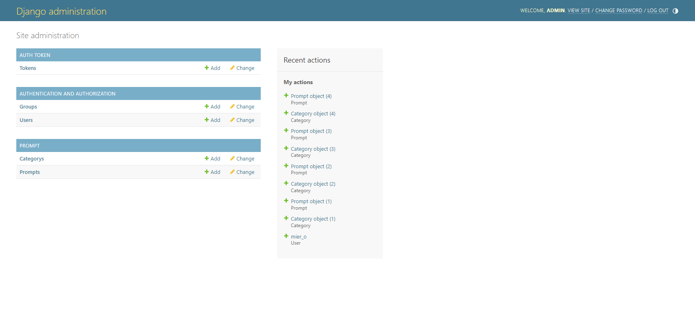

# ChatMier
一个美观流畅的ChatGPT提示网站，帮助你学习如何进行高质量提问。
by [GentleLemon](https://github.com/GentleLemon)

## 环境
- Python: 3.10
- Nuxt: 3
- Node: 18.16.0

## 克隆项目  
git clone https://github.com/GentleLemon/chatmier-prompt.git  

安装 virtualenv 包：  
sudo apt install python3-venv  

新建虚拟环境  
python3.10 -m venv venv  

激活虚拟环境  
source venv/bin/activate  

升级pip  
pip install --upgrade pip

安装依赖  
pip install -r requirements.txt

## 后端服务
cd chatmier_backend  

### 数据库迁移  
python manage.py makemigrations  
python manage.py migrate  

### 创建超级管理员  
python manage.py createsuperuser  
账号：admin  
邮箱：admin@admin.com  
密码：password  

### 启动后端服务
python manage.py runserver

### 访问后台  
http://127.0.0.1:8000/admin

## 前端服务
cd chatmier_frontend  

### 安装 Node.js 和 npm  
sudo apt update  
sudo apt install nodejs npm  

升级  
sudo npm install n -g  
sudo n stable  
hash -r  

### 安装pinia  
npm install pinia @pinia/nuxt

### 通过npm安装tailwindcss及其对等依赖，然后运行init命令生成文件tailwind.config.js   
npm install -D tailwindcss postcss autoprefixer  
npx tailwindcss init

安装yarn  
curl -sS https://dl.yarnpkg.com/debian/pubkey.gpg | sudo apt-key add -  
echo "deb https://dl.yarnpkg.com/debian/ stable main" | sudo tee /etc/apt/sources.list.d/yarn.list  
sudo apt update  
sudo apt install yarn  
yarn --version  

### 安装依赖  
yarn install  

### 启动前端服务
yarn dev

### 访问网页  
http://127.0.0.1:3000

